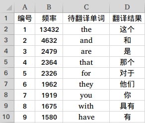

#　单词频数统计程序　


## 1. 功能说明：

程序执行 `python3 main.py ` 运行结果如下：

```
Number of all words : 18874
Translation results : 1 13432 --> the : 这个
Translation results : 2 4632 --> and : 和
Translation results : 3 2479 --> are : 是
Translation results : 4 2364 --> that : 那个
Translation results : 5 2326 --> for : 对于
Translation results : 6 1962 --> they : 他们
Translation results : 7 1919 --> you : 你
Translation results : 8 1675 --> with : 具有
Translation results : 9 1580 --> have : 有

```

保存的 resutls.xlsx 文件截图如下：
<p align="left">
  
</p>

## 2. 使用说明：

1. main.py 
程序用于统计 CET6_txt 文件夹中 .txt 文档中的单词的频数，最总结果将保存在 results.xlsx 中。
程序流程：1. 读取各个文档中的内容；2. 将单词按降序排列；3. 调用百度翻译API翻译每一个单词并保存至excel文档。

2. BaiduTransAPI_forPython3.py 
程序是从百度翻译API下载的翻译DEMO文件.官网链接：http://api.fanyi.baidu.com/doc/21
程序流程：1. 输入英文单词或句子；2. 返回调用百度翻译API翻译的结果。

3. 上述两个文件可单独运行，无交集。


## 3. 其他说明：

暂无
